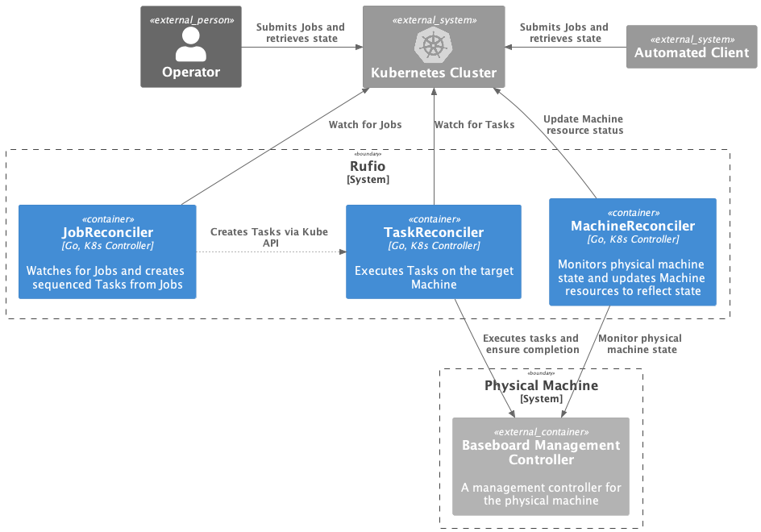

# Rufio

## Who is Rufio?

Besides being the leader of the Lost Boys after Peter Pan left Neverland, Rufio is a kubernetes controller for managing baseboard management controllers (BMC) in a Tinkerbell context. Rufio can also execute jobs to perform a set of one-off management actions to bring a machine (physical hardware) to a desired state.

## Architecture


Rufio controller consists of three main API types, [Machine](https://github.com/tinkerbell/rufio/blob/main/api/v1alpha1/machine.go), [Job](https://github.com/tinkerbell/rufio/blob/main/api/v1alpha1/job.go) and [Task](https://github.com/tinkerbell/rufio/blob/main/api/v1alpha1/task.go). An operator or an automated client like [CAPT](https://github.com/tinkerbell/cluster-api-provider-tinkerbell) can interact with Rufio using these APIs to manage the state of their physical machines.

### Machine API

The Machine type contains the information required for communicating with the BMC of the physical hardware.

```yaml
apiVersion: bmc.tinkerbell.org/v1alpha1
kind: Machine
metadata:
  name: machine-sample
spec:
  connection:
    host: 0.0.0.0
    port: 623
    authSecretRef:
      name: bm-auth
      namespace: sample
    insecureTLS: false
```

The `connection` object contains the required fields for establising a BMC connection. Fields `host`, `port` represent the BMC IP for the physical machine and `insecureTLS` instructs weather to use insecure TLS connectivity for performing BMC API calls. Field `authSecretRef` is a `SecretReference` which points to a kubernetes secret that contains the username/password for authenticating BMC API calls.

### Machine controller

When a Machine object is created on the cluster, the machine controller is responsible for updating the current state of the physical machine. It performs API calls to the BMC of the physical machine and updates the `status` of the Machine object.

### Job API

The Job type is used to define a set of one-off operations/actions to be performed on a physical machine. These actions are performed utilizing BMC API calls.

```yaml
apiVersion: bmc.tinkerbell.org/v1alpha1
kind: Job
metadata:
  name: job-sample
spec:
  machineRef:
    name: machine-sample
    namespace: sample
  tasks:
    - powerAction: "off"
    - oneTimeBootDeviceAction:
        device:
          - "pxe"
        efiBoot: false
    - powerAction: "on"
```

The `machineRef` points to the Machine object on the cluster, for which the job is executed. The `tasks` list is a set of ordered actions to be performed on the machine.
> Note: A single task can only perform one type of action. For example either PowerAction or OneTimeBootDeviceAction.

### Job Controller

The job controller watches for Job objects on the cluster. Once a new job object is created, it immediately sets the job condition to `Running` and creates a `Task` object on the cluster for the first item in the tasks list.

The job controller also watches for changes in `Task` objects which have an ownerRef pointing to a Job. Once a Task object status is updated, the job controller checks the conditions on the Task and either marks the Job as Completed/Failed or proceeds to create the next Task object.

### Task API

The task type represents a single one-off action performed against a BMC of a physical machine.

```yaml
apiVersion: bmc.tinkerbell.org/v1alpha1
kind: Task
metadata:
  name: task-sample
spec:
  connection:
    host: 0.0.0.0
    port: 623
    authSecretRef:
      name: bm-auth
      namespace: sample
    insecureTLS: false
  task:
    powerAction: "on"
```

### Task controller

The Task controller watches for Task objects on the cluster. When a new Task is created, the controller executes the corresponding action. Once the action is completed, the controller reconciles to check for the state of the physical machine. This ensures the action was completed successdully and marks the `status` as `Completed/Failed` accordingly.

## Getting Started

For running Rufio, we require a k8s cluster that has access to the BMC network of the physical machines. 

For the purpose of this tutorial, lets create a [kind](https://kind.sigs.k8s.io/) cluster.

```bash
kind create cluster
```

Once the cluster is created, we can run the make target to generate a manifest to apply the CRDs and controller deployment.

```bash
make release-manifests
```

The manifest gets generated under `./out/release/manifest.yaml`, we can then apply the manifest to the cluster.

```bash
kubectl apply -f ./out/release/manifest.yaml
```

We can now see the Rufio controller pod running on the cluster under the `rufio-system` namespace.

```bash
kubectl get po -n rufio-system

NAME                                        READY   STATUS    RESTARTS   AGE
rufio-controller-manager-6c96d86cf5-kbvdj   1/1     Running   0          5s
```

We can now interact with Rufio using its API. Before creating a Mahine object, we need to create a k8s Secret that contains the BMC user credentials for the physical machine. An example Secret,

```yaml
apiVersion: v1
kind: Secret
metadata:
  name: bm-auth
  namespace: sample
data:
  username: cm9vdA==
  password: cm9vdA==
type: kubernetes.io/basic-auth
```

Now we can modify the sample [yaml](https://github.com/tinkerbell/rufio/blob/main/config/samples/bmc_v1alpha1_machine.yaml) with the relavent connetion values and create a Machine object.

```bash
kubectl apply -f ./config/samples/bmc_v1alpha1_machine.yaml
```

We can obsesrve the status of the Machine object gets updated with current state of the physical machine.

```bash
kubectl get machines -o=jsonpath='{.items[0].status}'
```

```json
{
    "conditions": [
        {
            "lastUpdateTime": "2022-08-31T20:01:35Z",
            "status": "True",
            "type": "Contactable"
        }
    ],
    "powerState": "on"
}
```

Finally, we can create a Job with a few actions,

```bash
kubectl apply -f ./config/samples/bmc_v1alpha1_job.yaml

kubectl get jobs.bmc.tinkerbell.org

NAMESPACE      NAME            AGE
default        job-sample      5s
```

We can also observe that that Task objects were created for each individual task listed on the Job.

```bash
kubectl get tasks.bmc.tinkerbell.org -A

NAMESPACE      NAME                   AGE
default        job-sample-task-0      8s
default        job-sample-task-1      5s
default        job-sample-task-2      3s
```

### Provider Options

Options per provider can be defined in the `spec.connection.providerOptions` field of a `Machine` or `Task` object.

> Note: when the `rpc` provider options are specified:  
    1. the `authSecretRef` is not required, otherwise it is required.  
    2. under the hood, no other providers will be tried/used.

`Machine` CR example:

> Note: The provider options below are not comprehensive. See the [spec](../api/v1alpha1/) for all available options.

```yaml
apiVersion: bmc.tinkerbell.org/v1alpha1
kind: Machine
metadata:
  name: machine-sample-with-opts
spec:
  connection:
    host: 127.0.0.1
    insecureTLS: true
    authSecretRef:
      name: sample-machine-auth
      namespace: rufio-system
    providerOptions:
      redfish:
        port: 443
      ipmitool:
        cipherSuite: 3
        port: 623
      intelAMT:
        port: 16992
      rpc:
        consumerURL: "https://example.com/rpc"
        hmac:
          secrets:
            sha256:
              - name: secret1
                namespace: default
              - name: secret2
                namespace: default
            sha512:
              - name: secret1
                namespace: default
              - name: secret2
                namespace: default
```

`Task` CR example with all providers defined in the options section:

```yaml
apiVersion: bmc.tinkerbell.org/v1alpha1
kind: Task
metadata:
  name: task-sample
spec:
  connection:
    host: 127.0.0.1
    insecureTLS: true
    authSecretRef:
      name: sample-machine-auth
      namespace: rufio-system
    providerOptions:
      redfish:
        port: 443
      ipmitool:
        cipherSuite: 3
        port: 623
      intelAMT:
        port: 16992
      rpc:
        consumerURL: "https://example.com/rpc"
        hmac:
          secrets:
            sha256:
              - name: secret1
                namespace: default
              - name: secret2
                namespace: default
            sha512:
              - name: secret1
                namespace: default
              - name: secret2
                namespace: default
  task:
    powerAction: "off"
```

### Secrets

There are two options for secrets.

Option 1: A standard username/password. This is defined in a secret with `data.username` and `data.password`.

```yaml
apiVersion: v1
kind: Secret
metadata:
  name: sample-machine-auth
type: Opaque
data: # admin/t0p-Secret; echo -n 'admin' | base64; echo -n 't0p-Secret' | base64
  username: YWRtaW4=
  password: dDBwLVNlY3JldA==
```

Option 2: When using the RPC provider, define a secret with `data.secret`.

```yaml
apiVersion: v1
kind: Secret
metadata:
  name: secret1
type: Opaque
data: # echo -n 'superSecret1' | base64;
  secret: c3VwZXJTZWNyZXQx
```
